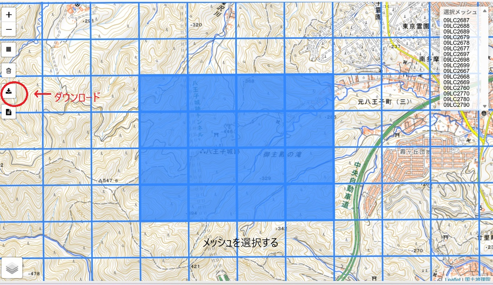
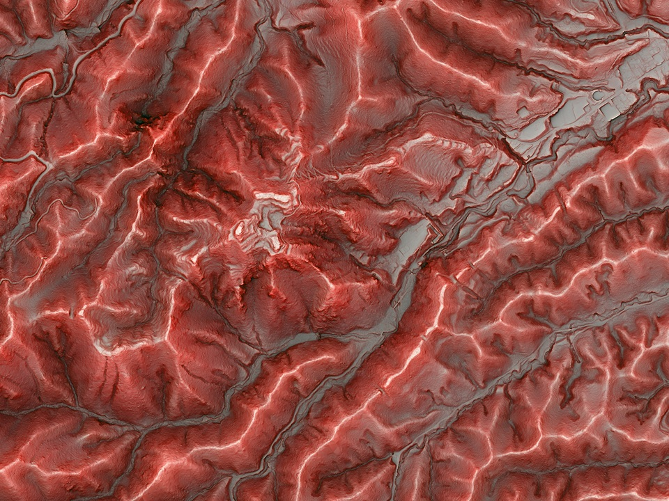
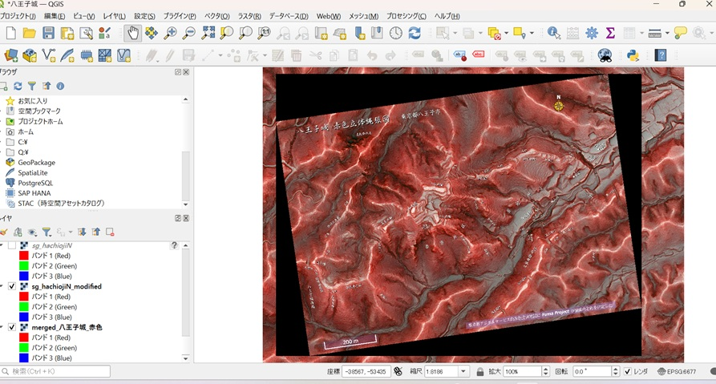
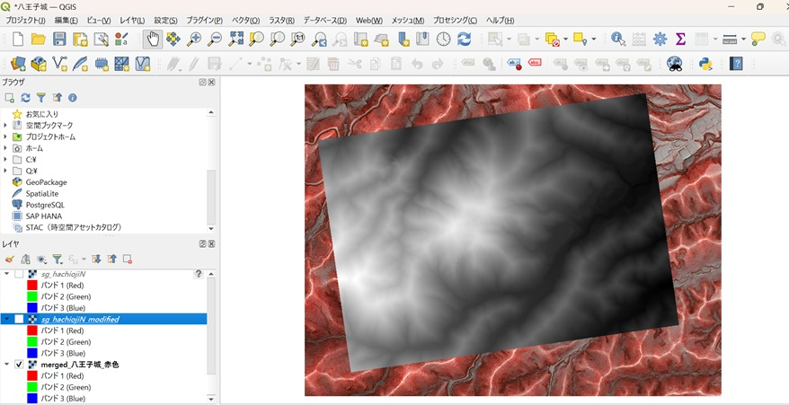
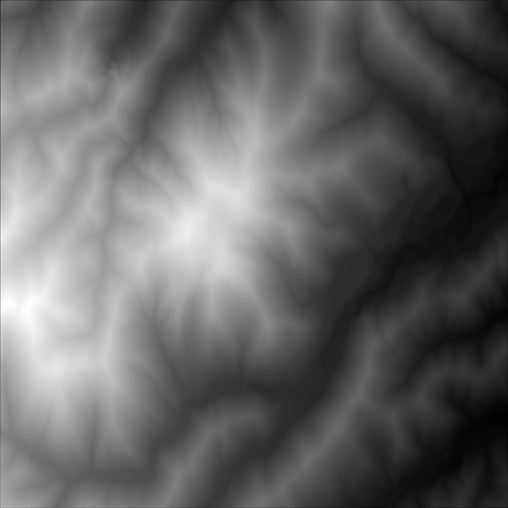
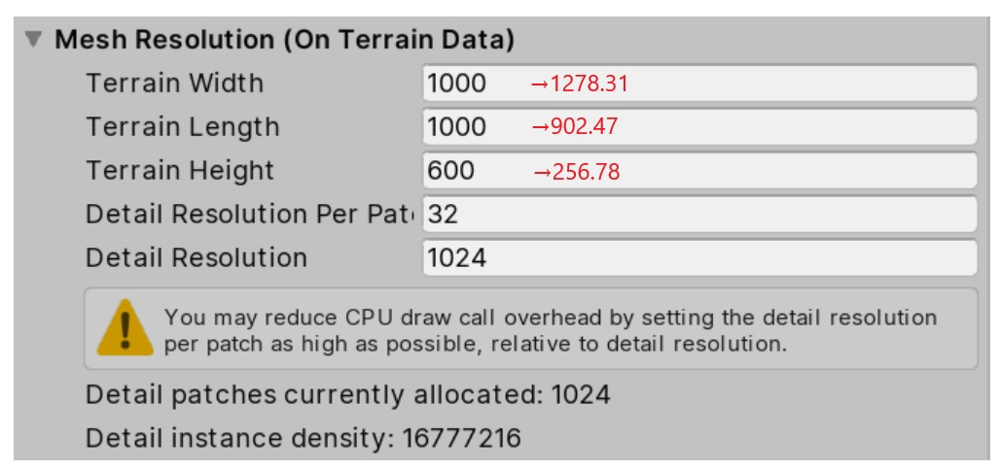
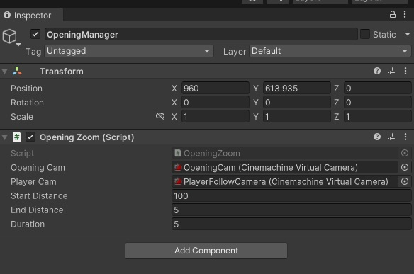
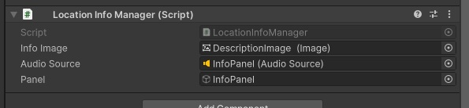
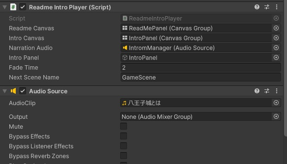

# 🏯 八王子城バーチャル案内 (WebGL)
# Hachioji Castle 3D Exploration

本プロジェクトは、八王子城跡を 3D 空間上で自由に探索できるアプリケーションです。  
プレイヤー（ロボット）を操作し、史跡内の各地点へ移動しながら地形や遺構の理解を深めることを目的としています。

WEBGL ビルドに対応しており、ブラウザ上で操作可能です。

🔗 公開サイト  
https://matsumura-shoichi.github.io/Hachioji-jo/

---

# 📑 目次

1. [プロジェクト概要](#-プロジェクト概要)
2. [地形データの作成方法](#-地形データの作成方法八王子城跡の再現)
3. [主な機能](#-主な機能)
4. [使用スクリプト一覧](#-使用スクリプト一覧)
5. [カメラ揺れの実装](#-カメラ揺れの実装について)
6. [スクリプト設定ガイド](#-スクリプト設定ガイドinspector-設定例付き)
7. [操作方法](#-操作方法)
8. [使用データ・出典](#-使用データ出典)
9. [開発環境](#️-開発環境)

---

# 🎮 プロジェクト概要

- 実測 DEM データを用いた実寸スケール地形再現
- 三人称視点によるフィールド探索
- 地点ごとの歴史解説表示
- Cinemachine を活用した演出
- WEBGL 対応（ブラウザ操作）

---

# 🌍 地形データの作成方法（八王子城跡の再現）

本プロジェクトでは、実際の DEM（数値標高モデル）を用いて地形を再現しています。

## ■ 使用データ

- 0.25m DEM（東京都デジタルツイン実現プロジェクト 多摩地域点群データ）  

- 八王子城赤色立体縄張り図  

---

## ① QGIS による位置合わせ

1. 縄張り図を QGIS に読み込む  
2. ジオレファレンス機能で DEM と位置合わせ  
3. 城跡範囲を切り抜く  
4. GeoTIFF 形式で保存  

  

---

## ② GeoTIFF の正規化

縄張り図範囲：

- 最小標高：222.44m  
- 最大標高：479.22m  
- 標高差：256.78m  

処理内容：

- (標高 − 最小標高) ÷ 標高差 で 0〜1 に正規化
- 16bit 整数（0〜65535）へ変換
- 解像度を 4097 × 4097 pixel に統一  

---

## ③ RAW 形式への変換

- GeoTIFF を南北反転
- 16bit RAW 形式で保存

※ Unity は南北が逆になるため反転が必要

---

## ④ Unity へのインポート

### Terrain 設定

- Heightmap Resolution：4097  
- Terrain Size  
  - 横：約1278m  
  - 縦：約902m  
  - 高さ：256.78m  

`Terrain → Import Raw` で読み込みます。

---

## ⑤ 結果

実測 DEM に基づいた、実寸スケールの八王子城跡地形を Unity 上に再現しています。

---

# 🎮 主な機能

- 三人称視点による探索
- 地点選択テレポート
- 落下演出（SE + カメラ揺れ）
- 初回のみ地点解説表示
- WEBGL 360度カメラ対応
- マウスロック制御

---

# 🧩 使用スクリプト一覧

| Script名 | 役割 |
|-----------|------|
| TeleportManager.cs | 落下演出付きテレポート |
| CinemachineShake.cs | 着地カメラ揺れ |
| LocationInfoManager.cs | 地点説明UI |
| WebGLCameraControl.cs | WEBGLカメラ制御 |
| QuitGame.cs | 終了処理 |

---

# 🎥 カメラ揺れの実装について

着地時のカメラ揺れは Cinemachine の  
**Basic Multi Channel Perlin（Noise）** を利用しています。

Amplitude Gain / Frequency Gain を一時的に変更することで、  
着地時のみ揺れを発生させています。

---

# 🔧 スクリプト設定ガイド（Inspector 設定例付き）

各スクリプトのアタッチ先と Inspector 設定例を以下に示します。

---

## 🎬 OpeningZoom.cs

上空からプレイヤーへズームするオープニング演出。

---

## 📍 TeleportManager.cs

テレポート処理・SE・カメラ距離リセット。

.jpg)

---

## 🌍 LocationInfoManager.cs

地点説明表示（初回のみ）。

---

## 📡 CinemachineShake.cs

Noise を使用したカメラ揺れ。

.jpg)

---

## 🖱️ WebGLCameraControl.cs

WEBGL マウス制御。

.jpg)

---

## 📖 ReadmeIntroPlayer.cs

イントロ表示制御。

---

# ⌨️ 操作方法

| 操作 | 内容 |
|------|------|
| 矢印キー | 移動 |
| Shift + 矢印 | 走行 |
| 右クリック | 視点操作 |
| マウスホイール | ズーム |
| ESC | カーソル解除 |

---

# 📚 使用データ・出典

## ■ 地形データ
東京都デジタルサービス局  
東京都デジタルツイン実現プロジェクト  
https://www.geospatial.jp/ckan/dataset/tokyopc-tama-202

## ■ 地図データ
八王子城公式ガイドHP編集部（風魔 Project）  
赤色立体縄張り図  
https://tensho18.jp/k_geospm.html

## ■ 解説資料
八王子市教育委員会 文化財課  
八王子城跡散策マップ  
https://www.city.hachioji.tokyo.jp/kurashi/kyoiku/005/bunkazaikanrenshisetsu/p005201.html

---

# ⚠️ ライセンス・注意事項

本プロジェクトは教育・研究目的で作成されています。  
各種データの著作権はそれぞれの作成機関に帰属します。  
二次利用の際は必ず出典元の利用規約をご確認ください。

---

# 🛠️ 開発環境

- Unity（Starter Assets Third Person Controller）
- Cinemachine
- Windows / WEBGL